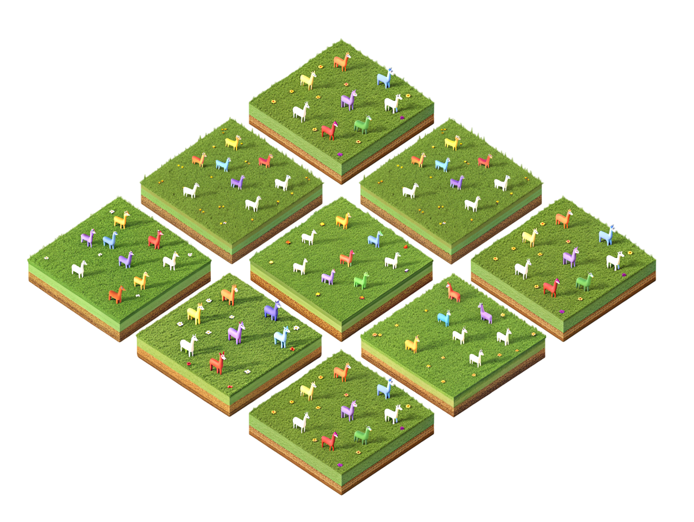
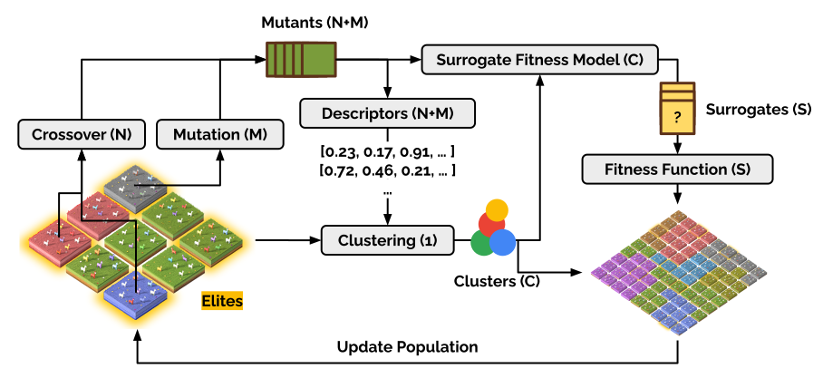

<div align="center">

  
  <h1>AgentBreeder</h1>
  
  <p>
    Automated Design of Multi-Agent Large Language Model Systems via Evolution
  </p>
  
  
<!-- Badges -->
<p>
  <a href="https://github.com/J-Rosser-UK/AgentBreeder/contributors">
    
  </a>
  <a href="">
    
  </a>
  <a href="https://github.com/J-Rosser-UK/AgentBreeder/network/members">
    
  </a>
  <a href="https://github.com/J-Rosser-UK/AgentBreeder/stargazers">
    
  </a>
  <a href="https://github.com/J-Rosser-UK/AgentBreeder/issues/">
    
  </a>
  <a href="https://github.com/J-Rosser-UK/AgentBreeder/blob/master/LICENSE">
    
  </a>
</p>
   
<h4>
    <!-- <a href="https://github.com/J-Rosser-UK/AgentBreeder/">View Demo</a> -->
  <!-- <span> · </span> -->
    <a href="https://docs.google.com/presentation/d/197lRGAtPoG1NWLJ_fDOLTHBlyz9eA6G35g-XNvyb9To/edit?usp=sharing">Documentation</a>
  <span> · </span>
    <a href="https://github.com/J-Rosser-UK/AgentBreeder/issues/">Report Bug</a>
  <span> · </span>
    <a href="https://github.com/J-Rosser-UK/AgentBreeder/issues/">Request Feature</a>
  </h4>
</div>

<br />

 

## Abstract

Open-Ended processes are those which lead to diverse, complex, and innovative solutions over time, and it has been proposed that open-endedness is an essential property of any Artificial Superhuman Intelligence (ASI). While many existing AI models excel at specific tasks, they often lack "Open-Endedness". Inspired by biological evolution and open-ended processes, AgentBreeder leverages techniques inspired by Bayesian Illumination to efficiently automate the generation of novel Large Language Model (LLM) multi-agent systems.

Multi-agent systems offer modularity, specialization, and enhanced control, enabling agents to collaborate and adapt dynamically. AgentBreeder builds upon the Automated Design of Agentic Systems (ADAS) system by integrating three key innovations: graph-based genetic algorithms to enhance collaboration and architecture design, MAP-Elites for clustering and diversely sampling high-performing systems, and BOP-Elites for sample-efficient exploration. These techniques ensure the creation of diverse, high-performing agent systems while reducing computational costs.

This methodology holds promise for accelerating performance and safety evaluations of Multi-Agent systems, and with that in mind, all evals are implemented in Inspect.

## Directory Structure
```
AgentBreeder/
  ├── README.md
  ├── Dockerfile
  ├── LICENSE
  ├── requirements.txt
  ├── .env.sample
  ├── .flake8
  ├── assets/
  │   └── source.txt
  └── src/
      ├── eval.py
      ├── main.py
      ├── base/
      │   ├── __init__.py
      │   ├── base.py
      │   ├── session.py
      │   └── tables.py
      ├── chat/
      │   ├── __init__.py
      │   ├── api.py
      │   ├── chat.py
      │   ├── test_api.py
      │   └── test_api_requests.py
      ├── descriptor/
      │   ├── __init__.py
      │   └── descriptor.py
      ├── evals/
      │   ├── __init__.py
      │   ├── arc.py
      │   ├── benchmark.py
      │   ├── clrs_text.py
      │   ├── drop.py
      │   ├── gpqa.py
      │   ├── metrics.py
      │   ├── mgsm.py
      │   ├── mmlu.py
      │   ├── test_arc.py
      │   ├── test_clrs_text.py
      │   ├── test_mmlu.py
      │   └── validator.py
      ├── generator/
      │   ├── __init__.py
      │   ├── generator.py
      │   └── mutator.py
      ├── illuminator/
      │   ├── __init__.py
      │   └── illuminator.py
      ├── prompts/
      │   ├── initial_population.py
      │   ├── mutation_base.py
      │   ├── mutation_prompts.py
      │   ├── mutation_reflexion.py
      │   └── utils.py
      └── visualizations/
          ├── tree.py
          └── visualizer.py

```

## Run with Docker
```
git clone https://github.com/J-Rosser-UK/AgentBreeder

cd AgentBreeder

sudo docker build -t agent_breeder .

sudo docker run -it agent_breeder

```


## Run directly
```
git clone https://github.com/J-Rosser-UK/AgentBreeder

cd AgentBreeder

cd src

python -m venv venv 

venv/Scripts/activate // windows

source venv/bin/activate // unix

pip install -r requirements.txt

### in a different terminal ###
python src/chat/api.py
###############################
 
python src/main.py --population_id None
```

